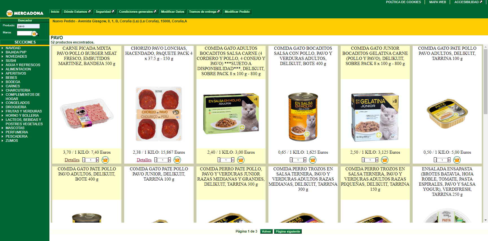
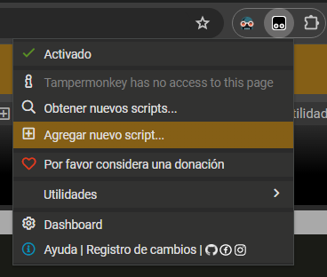
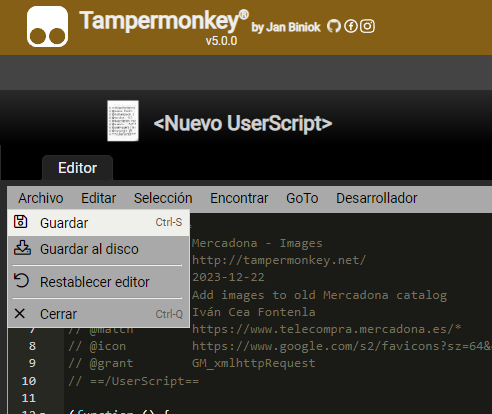

# Mercadona - Rediseño con imágenes

> For the English version, [click here](README.md)

## Descripción

Script de Tampermonkey para mostrar imágenes en la [antigua web de Mercadona](https://www.telecompra.mercadona.es/).

Es un rediseño de la página:

- La tabla se cambia por una cuadrícula
- Cada artículo ahora muestra su imagen, tomada de la nueva web de Mercadona (Incluso aunque no funcione aún en tu localización)

## Cómo usar

_Nota:_ Para mí, la antigua web no funciona en Firefox; no me deja iniciar sesión. Todo esto ha sido probado en Chrome.

1. Instala la extensión Tampermonkey en tu navegador. Descárgala aquí: <https://www.tampermonkey.net/>
2. Abre la extensión:
    
3. En el menú de la extensión, haz click en "Añadir nuevo script":
    
4. Copia el código del archivo [tampermonkey.js](tampermonkey.js) y reemplaza el código que aparece en nuevo script con él
5. Guarda con `CTRL+S` (Windows) o yendo a `Archivo > Guardar` en el menú:
    
6. Ve a la web de Mercadona, o recárgala si ya estaba abierta. Prueba a buscar algún producto

Ahora, mientras buscas los productos, deberías ver una cuadrícula en lugar de la tabla.

_Nota:_ Puede tardar un poco (Menos de un segundo) en aparecer la nueva cuadrícula. Si no aparece, prueba a recargar la página, revisar las instrucciones de nuevo, o abrir un ticket en este repositorio.

## Advertencia

Este script no es oficial, y no está relacionado con Mercadona de ninguna manera.

Si en algún momento el script deja de funcionar, las imágenes dejan de cargarse, o la web te bloquea de alguna manera, por favor desactiva o elimina el script, y abre un ticket en este repositorio.
