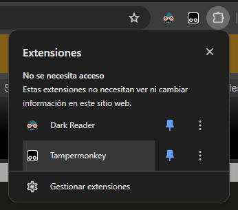
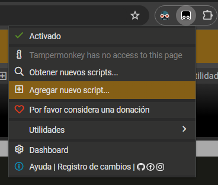
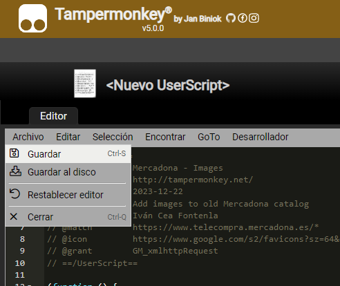

# Mercadona - Images redesign

> Para la versión en Español, [haz click aquí](README-ES.md)

## Description

A Tampermonkey script to show images in the [old Mercadona website](https://www.telecompra.mercadona.es/).

It's a re-style of the page:

- The table is changed to a grid
- Each article now shows its image, taken from the new Mercadona website (Even if it doesn't work yet in your location)

## How to use

_Note:_ For me, the old website doesn't work on Firefox, it won't let me log-in. This all was tested in Chrome.

1. Install Tampermonkey extension in your browser. Download it here: <https://www.tampermonkey.net/>
2. Open the extension:
    
3. In the extension menu, click on "Add new script":
    
4. Copy the code from the [tampermonkey.js](tampermonkey.js) file and replace the existing code of the new script with it
5. Save with `CTRL+S` (Windows) or going to `File > Save` in the menu:
    
6. Go to the Mercadona website, or reload it if it was already open. Try searching for some product

Now, while searching the products, you should see a grid instead of the table.

_Note:_ It may take some time (Less than a second) for the new grid to appear. If it doesn't, try reloading the page, checking the instructions again, or opening an issue in this repository.

## Warning

This script is not official, and it's not related to Mercadona in any way.

If in any moment the script stop working, the images won't load anymore, or the website blocks you in any way, please disable or remove the script, and open an issue in this repository.
